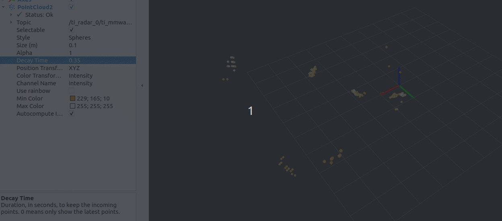
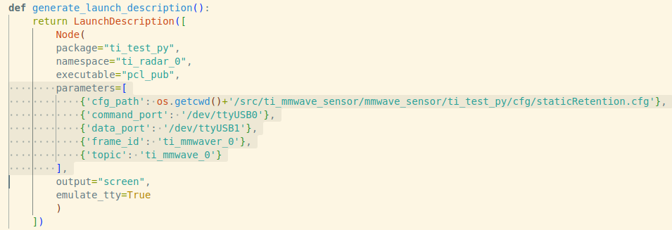

# TI_IWR6843AOP_ROS2




Refered to: 
```sh
git clone https://git.ti.com/git/mmwave_radar/mmwave_ti_ros.git
```

Another example: https://github.com/nhma20/iwr6843aop_pub

A different method is used when parsing serial port data, and more pointclouds can be acquired without instant failure.

### Enviornment

- ROS2 (Ubuntu 22.04 & humble)
- Python3 (3.10.12)
- IWR6843AOPEVM (ES2) mmWave radar device flashed with out-of-box firmware

### Installation

1. Clone the repo to workspace
   ```sh
   cd ~/${workspace}/src/
   git clone https://github.com/nhma20/iwr6843aop_pub.git
   ```
2. Colcon build package
   ```sh
   cd ~/${workspace}
   colcon build --packages-select ti_test_py
   ```
3. Revise parameters in the launch file

    

4. Start
    ```sh
    source ./install/setup.bash
    ros2 launch ti_test_py 6843aop_3d_0.launch.py
    ```
