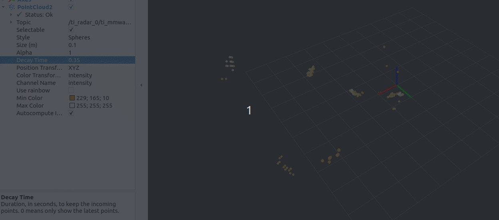
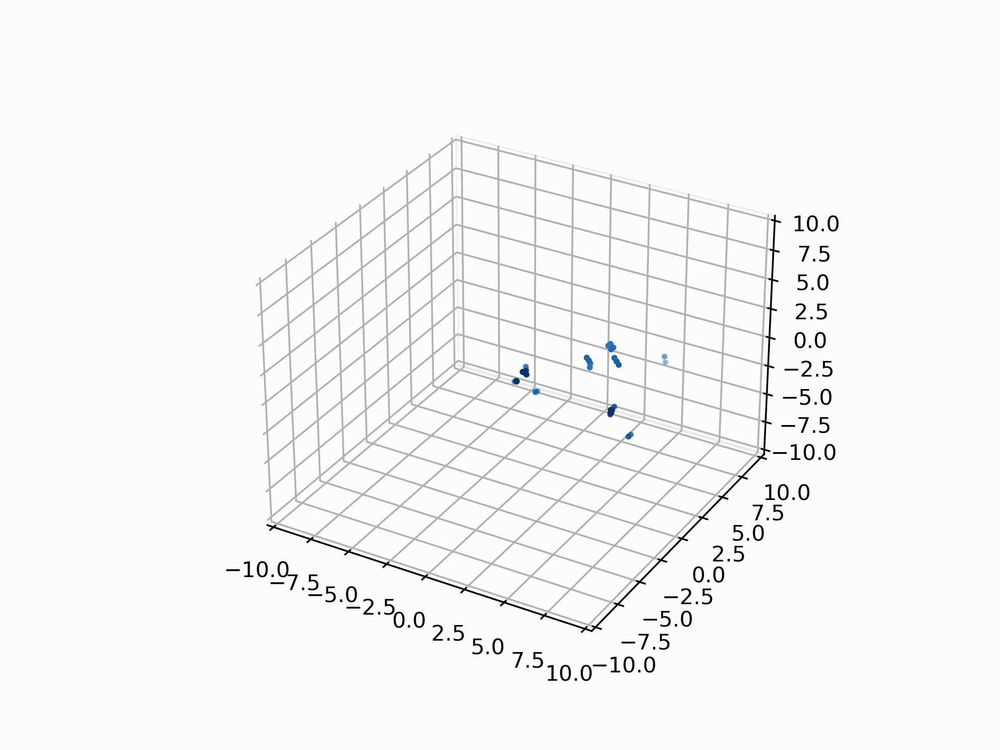
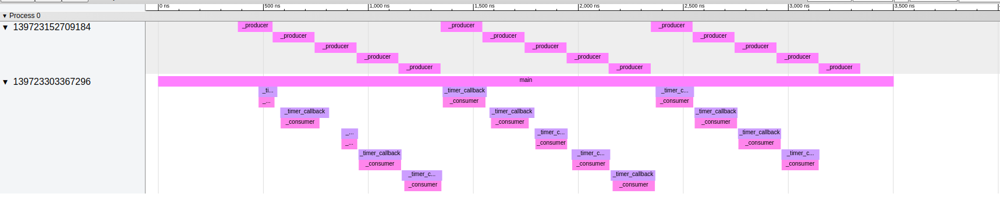
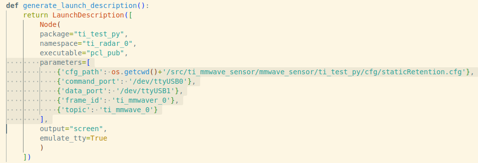

# TI_IWR6843AOP

### Enviornment

- ROS2 (Ubuntu 22.04 & humble)
- Python3 (3.10.12)
- IWR6843AOPEVM (ES2) mmWave radar device flashed with out-of-box firmware
- docker (optional)

By rviz2 (a [dockerfile](./ros2_rviz_docker/humble_docker/Dockerfile) is provided for setting up a lightweight ros2 environment on the remote client side):



By [visualizer.py](./ti_test_py/ti_test_py/visualize.py):



A different method is used when parsing serial port data, and more pointclouds can be acquired without instant failure. Now the offical driver version for ros2 is released: git://git.ti.com/mmwave_radar/mmwave_ti_ros.git

```chrome://tracing/``` is used to visualize threads, and the json for demo is located in the [benchmark folder](./ti_test_py/img/benchmark/). However, the function is not neccessary when using the sensor. Ignore the benchmark module if not appealing.


### Installation

1. Clone the repo to workspace
   ```sh
   cd ~/${workspace}/src/
   git clone https://github.com/lightinfection/TI_IWR6843AOP.git
   ```
2. Colcon build package
   ```sh
   cd ~/${workspace}
   colcon build --packages-select ti_test_py
   ```
3. Revise parameters in the launch file

    

### Run the mmWave sensor

1. Start
    ```sh
    source ./install/setup.bash
    ros2 launch ti_test_py 6843aop_3d_0.launch.py
    ```

2. (Optional) Review pointcloud data by rviz in a docker container: 
    ```sh
    cd ./ros2_rviz_docker && ./build.sh
    ./rviz_remote.sh
    cd robot_remote/robot_rviz && rviz2 -d ${rviz_filename}
    ```