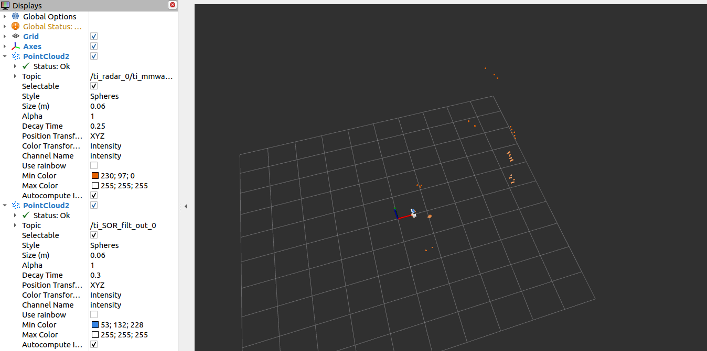

# TI_IWR6843AOP

Now the official driver version for ros2 has been released: 

git://git.ti.com/mmwave_radar/mmwave_ti_ros.git

### Enviornment

- IWR6843AOPEVM (ES2) mmWave radar device flashed with out-of-box firmware
- Python3 (3.10.12)
- ROS2 (Ubuntu 22.04 & humble) (local or docker)

<!-- A [dockerfile](./ros2_rviz_docker/humble_docker/Dockerfile) is provided for building a container where mmwave can run. -->

### Installation

#### Local
1. Clone to your workspace
   ```sh
   git clone https://github.com/lightinfection/TI_IWR6843AOP.git
   ```
2. Build package (Using GDB to build object_detection package if cmake-args is declared as below)
   ```sh
   colcon build --cmake-args '-DCMAKE_BUILD_TYPE=RelWithDebInfo' --packages-select object_detection
   colcon build --packages-select ti_ros2_driver
   source install/setup.bash
   ```

<!-- #### Docker -->

### Use the mmWave sensor in local ROS2

#### Single-frame
1. Plugin mmWave sensor and start (if using debug mode, please load [.json](./src/ti_ros2_driver/debug/result.json) to chrome://tracing/ for log visualization)
    ```sh
    ros2 launch ti_ros2_driver 6843aop_3d_0.launch.py
    ```
    
    
2. Filters for mmWave single frame signals (Examples)
    ```sh
    ## passthrough filters + statiscal outlier removal
    ros2 launch object_detection filter_for_ti_static.launch.py
    ## noise removal by dbscan clustering
    ros2 launch object_detection filter_for_dbscan_cluster.launch.py
    ```
3. Check outcomes on RVIZ
    ```sh
    cd src/object_detection/rviz
    rviz2 -d mmwave_single_frame.rviz
    ```
    
    

#### Multi-frames
1. Prepare mmWave multiple frames data (raw pointcloud saved in either pcd or octomap)

2. Post Processing
    ```sh
    ## filter(Optional) + difference of L2 normal extraction
    ros2 launch object_detection filter_for_ti_dynamic.launch.py
    ```
    Statistical Outlier Removal + DON

    

    DBSCAN + DON

    