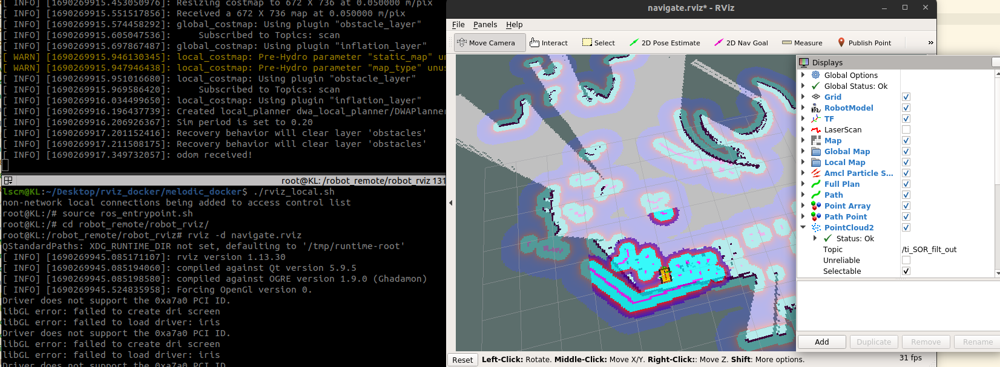

# ros1_rviz_docker

This image is developed to run a specific rviz under the ros-melodic environment in a docker hosted on a remote computer (ubuntu) instead of a robot. 

### **Dependencies**

* [`docker`](https://docs.docker.com/engine/install/)

### **Usage**

1. Clone the repo to the workspace
    ```sh
    git clone https://github.com/lightinfection/ros1_rviz_docker.git && cd ~/${workspace}/melodic_docker/
    ```
2. Setup ros environment

    Open the Dockerfile in the /melodic_docker file and edit the values of ROS_MASTER_URI and ROS_HOSTNAME according to your cases.
    ```sh
    RUN echo "export ROS_MASTER_URI=http://${ROBOT_IP}:11311/" >> ros_entrypoint.sh && echo "export ROS_HOSTNAME=${CONSOLE IP}" >> ros_entrypoint.sh 
    ```
3. Build an image with default name "melodic_rviz"
    ```sh
    ./build.sh
    ```
3. Open two terminals and enter the same container by executing the shell scripts separately
    ```sh
    ./roscore_local.sh
    ```
    ```sh
    ./rviz_local.sh
    ```
4. Start a specific rviz in terminal

    In one terminal:
    ```sh
    ssh ${hostname}@172.30.200.129
    roscore
    ```
    

    In the other terminal:
    ```sh
    cd robot_remote/robot_rviz && rviz -d ${rviz_filename}
    ```
    

    (Optional) If the robot doesn't need to be brought up on the remote console but can be locally booted, then only one terminal is needed. In this case, directly execute
    ```sh
    ./rviz_remote.sh
    cd robot_remote/robot_rviz && rviz -d ${rviz_filename}
    ```
5. Kill running docker container
    ```sh
    ./clc_container.sh
    ```
